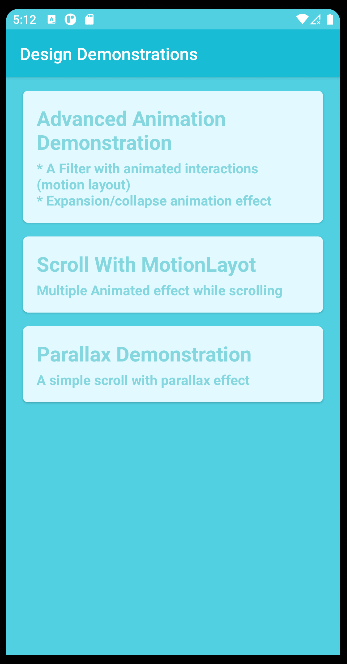
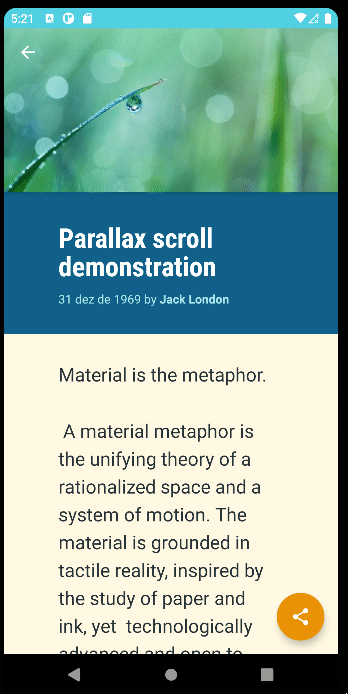

# MY SAMPLE WITH DESIGN CONCEPTS LEARNED SO FAR

# Layouts
## 1 - Custom filter layout with animations

I tried to implement the layout from the following Medium [article by @nikhilpanju](https://medium.com/proandroiddev/complex-ui-animations-on-android-featuring-motionlayout-aa82d83b8660) on my own.

During the implementation, whenever I encountered difficulties, I referred to his [repository]([https://github.com/nikhilpanju/Android-UI-Complex](https://github.com/nikhilpanju/FabFilter)) so that I could understand the differences and learn from them.

I attempted to implement the same animation twice, first using "low-level of abstraction" techniques, and secondly, using [motion layout](https://developer.android.com/training/constraint-layout/motionlayout).

This part of the layout can be checked [here](https://github.com/rafaelanastacioalves/android-design-concepts/tree/filter_layout/app/src/main/java/com/rafaelanastacioalves/design/concepts/ui/expand_collapse_animation).

## 2 - Motion layout

I learned some [motion layout](https://developer.android.com/training/constraint-layout/motionlayout) basics to understand the idea of applying these kinds of animations.

This part of the code can be checked [here](https://github.com/rafaelanastacioalves/android-design-concepts/tree/filter_layout/app/src/main/java/com/rafaelanastacioalves/design/concepts/ui/motion_layout_scroll).

## 3 - Parallax demonstration

Just some parallax during scrolling that I've learned from Android courses.
The code can be checked [here](https://github.com/rafaelanastacioalves/android-design-concepts/tree/filter_layout/app/src/main/java/com/rafaelanastacioalves/design/concepts/ui/articledetail).

# Building

The building process is pretty straightforward, just like any other Android [App](https://developer.android.com/studio/run) 😊.

